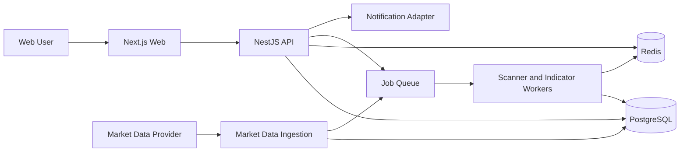
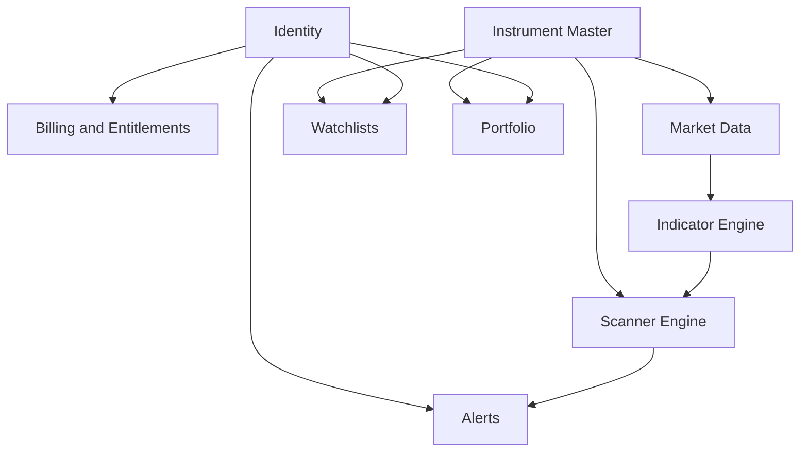

# ARCH-001 — Sistem Genel Mimarisi

**Mimari tarz:** Modüler monolith + worker süreçleri

## 1. Ana bileşenler

## 2. Modüller

### Identity & Access

Kayıt, giriş, oturum, rol, entitlement ve hesap durumu.

### Instrument Master

Sembol, şirket, sektör, pazar, endeks, sembol geçmişi ve kurumsal aksiyon.

### Market Data

Provider adapter, ingestion, normalizasyon, bar yaşam döngüsü, stale detection ve kalite kontrolü.

### Indicator Engine

Registry, parametre doğrulama, warm-up, batch hesaplama, cache ve referans testleri.

### Scanner Engine

Kural AST doğrulama, execution plan, koşul değerlendirme, açıklama ve karmaşıklık kontrolü.

### Alerts

Kural bağlama, planlama, trigger state, deduplication, bildirim ve teslimat geçmişi.

### Portfolio

Manuel işlemler, pozisyon, değerleme, gerçekleşen/gerçekleşmemiş kâr-zarar ve dağılım.

### Billing & Entitlements

Plan, özellik, kota, abonelik ve kullanım sayacı.

### Admin

Kullanıcı, provider, hazır tarama, sistem sağlık ve audit yönetimi.

## 3. Modül bağımlılıkları

## 4. İlk dağıtım birimleri

- `web`
- `api`
- `worker`
- `postgres`
- `redis`
- reverse proxy

Worker bağımsız ölçeklenebilir. Diğer domain modülleri ilk aşamada aynı API uygulamasında bulunur.

## 5. Piyasa verisi akışı

1. Provider adapter veriyi alır.
2. Veri normalize edilir.
3. Kalite kontrolü yapılır.
4. Bar kaydedilir.
5. Hesaplama işi kuyruğa yazılır.
6. İndikatör cache'i güncellenir.
7. İlgili alarmlar değerlendirilir.

## 6. Kullanıcı taraması akışı

1. Kullanıcı kural AST gönderir.
2. API entitlement ve karmaşıklık kontrolü yapar.
3. AST doğrulanır.
4. Hafif tarama senkron, ağır tarama asenkron çalışır.
5. Sonuç ve açıklama döner.
6. Kullanıcı isterse taramayı kaydeder.

## 7. Kritik kararlar

- Provider alanları domain modeline doğrudan sızmaz.
- Tarama kuralları string ifade yerine sürümlü AST olarak saklanır.
- İndikatör sonuçlarının tamamını kalıcı saklama zorunlu değildir; kullanım ölçümüne göre cache veya materialization yapılır.
- Alarm değerlendirmesi idempotent olmalıdır.
