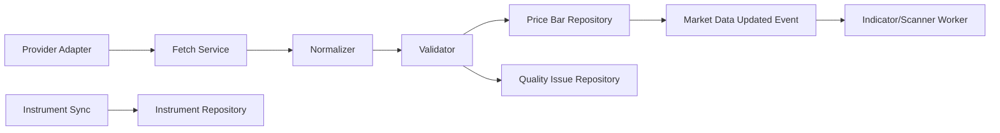

# ARCH-002 — Market Data Engine

**Sürüm:** 1.0  
**Durum:** Taslak

## 1. Amaç

Market Data Engine, BIST sembol ana verisini ve fiyat barlarını sağlayıcılardan alır, normalize eder, doğrular, saklar ve downstream modüllere güvenilir veri sunar.

## 2. Sorumluluklar

- provider abstraction,
- instrument synchronization,
- OHLCV ingestion,
- timeframe normalization,
- data quality checks,
- stale data detection,
- revision handling,
- corporate action metadata,
- ingest metrics,
- provider failover hazırlığı.

## 3. Kapsam dışı

- kullanıcı tarama kuralı,
- indikatör iş mantığı,
- alarm bildirim kanalı,
- yatırım skoru,
- broker emirleri.

## 4. Bileşenler



## 5. Provider arayüzleri

Önerilen capability yaklaşımı:

```typescript
interface MarketDataProvider {
  readonly code: string;
  getCapabilities(): ProviderCapabilities;
  listInstruments(): Promise<ProviderInstrument[]>;
  fetchBars(request: FetchBarsRequest): Promise<ProviderBarBatch>;
}
```

Provider capability örnekleri:

- supported timeframes,
- delayed/realtime,
- historical depth,
- corporate actions,
- fundamentals,
- pagination,
- rate limits.

## 6. Normalize edilmiş bar

```typescript
interface NormalizedPriceBar {
  instrumentId: string;
  timeframe: Timeframe;
  openTime: Date;
  closeTime: Date;
  open: DecimalString;
  high: DecimalString;
  low: DecimalString;
  close: DecimalString;
  volume: DecimalString;
  isClosed: boolean;
  providerCode: string;
  sourceTimestamp?: Date;
  ingestedAt: Date;
}
```

## 7. Validasyon

Zorunlu kontroller:

- high >= open/close/low
- low <= open/close/high
- volume >= 0
- closeTime > openTime
- timeframe ile bar süresi uyumlu
- duplicate bar
- zaman sırası
- beklenen bar boşluğu
- gelecek tarih
- provider symbol mapping
- sayı formatı.

Geçersiz veri doğrudan normal tabloya yazılmaz veya quality status ile karantinaya alınır.

## 8. Bar durumu

Bar:

- open,
- closed,
- corrected

durumlarından biriyle izlenebilir.

Açık bar verisi değişebilir.

Kesişim gibi sinyallerde:

- closed-bar only,
- intrabar preview

ayrımı yapılır.

## 9. Timeframe stratejisi

Sağlayıcıdan gelen en güvenilir taban zaman dilimi saklanır.

Üst zaman dilimleri:

- provider'dan doğrudan,
- veya deterministik aggregation

ile üretilebilir.

Aynı timeframe için birincil üretim yöntemi dokümante edilir.

## 10. Idempotency

Ingest job için anahtar:

```text
provider + instrument + timeframe + requested range
```

Bar upsert işlemi tekrar çalıştırılabilir olmalıdır.

## 11. Retry

Retry edilebilir:

- timeout,
- 429,
- geçici 5xx,
- bağlantı kesintisi.

Retry edilmez:

- kimlik doğrulama hatası,
- unsupported timeframe,
- invalid symbol mapping,
- malformed provider response.

Exponential backoff ve jitter kullanılır.

## 12. Veri tazeliği

Her instrument/timeframe için:

- latest source timestamp,
- latest ingest timestamp,
- expected next bar,
- stale status

hesaplanır.

UI, stale veriyi açıkça gösterebilir.

## 13. Provider değişimi

Domain kayıtları provider sembolüne değil internal `instrumentId` değerine bağlıdır.

Provider mapping ayrı tabloda tutulur.

## 14. Gözlemlenebilirlik

Metrikler:

- fetched bars,
- accepted bars,
- rejected bars,
- duplicate bars,
- provider latency,
- provider error rate,
- stale instruments,
- ingest lag,
- queue duration.

## 15. İlk faz veri akışı

1. BIST instrument listesi sync edilir.
2. Provider mapping oluşturulur.
3. Tarihsel günlük bar backfill edilir.
4. Son veri incremental alınır.
5. Kalite kontrolü yapılır.
6. Bar güncelleme olayı üretilir.
7. İndikatör hesapları sonraki fazda tetiklenir.
