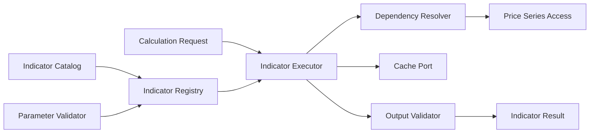

# ARCH-003 — Indicator Engine Architecture

**Durum:** Uygulamaya hazır

## Bileşenler



## Paket yapısı

```text
packages/domain/src/indicators/
├── contracts/
├── definitions/
├── math/
├── registry/
├── execution/
├── validation/
└── fixtures/
```

## Definition

```typescript
interface IndicatorDefinition<P, O> {
  readonly code: string;
  readonly version: number;
  readonly category: IndicatorCategory;
  readonly parameterSchema: Schema<P>;
  readonly outputSchema: Schema<O>;
  getWarmup(params: P): WarmupRequirement;
  calculate(input: IndicatorInput, params: P): O;
}
```

## Execution sırası

1. Definition çözülür.
2. Parametre doğrulanır.
3. Warm-up hesaplanır.
4. Input yeterliliği doğrulanır.
5. Cache okunur.
6. Hesaplama yapılır.
7. Output doğrulanır.
8. Cache yazılır.
9. Meta veriyle sonuç döner.

## Cache sınırı

Domain katmanı Redis bilmez. Application katmanı `IndicatorResultCache` portunu kullanır. Unit testte memory adapter kullanılabilir.

## Fixture standardı

Her fixture:

- input bars
- parameters
- expected outputs
- tolerance
- first valid index
- source/reason note

bulundurur.

## Sürümleme

Seed, smoothing veya sonuç davranışı değişirse version artırılır. Geçmiş run kullanılan `code@version` bilgisini saklar.

## Failure isolation

Batch içindeki tek indikatör hatası diğer sonuçları düşürmez. Her request success veya kontrollü hata sonucu üretir.
