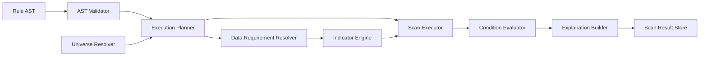
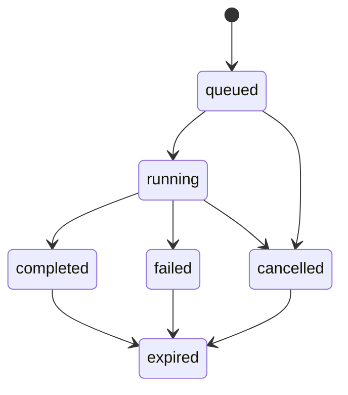

# ARCH-004 — Scanner Engine Architecture

**Durum:** Uygulamaya hazır

## Bileşenler



## Paket yapısı

```text
packages/domain/src/scanner/
├── ast/
├── operators/
├── validation/
├── planning/
├── evaluation/
├── explanation/
└── complexity/
```

## Stable nodeId

Her AST node stable `nodeId` taşır. Validation error path, UI edit, explanation, audit ve migration için kullanılır.

## Execution plan

```typescript
interface ScanExecutionPlan {
  planVersion: number;
  universe: ResolvedUniverse;
  dataRequirements: readonly DataRequirement[];
  indicatorRequests: readonly PlannedIndicatorRequest[];
  normalizedRule: ScanRuleAst;
  complexity: ScanComplexity;
  executionMode: 'sync' | 'async';
}
```

## Evaluator sınırı

Evaluator veri erişimi yapmaz. Normalize AST ve hazır operand değerlerini değerlendirir.

## Operator Registry

Her operatör:

- operand uyumluluğu
- gerekli geçmiş değer sayısı
- evaluator
- display metadata

sağlar.

## Run state machine



## Progress

Asenkron run ilerlemesi Redis'te tutulabilir; terminal durum PostgreSQL'e yazılır.

## İptal

Worker batch aralarında cancellation flag kontrol eder. İptal edilen run completed olamaz.
