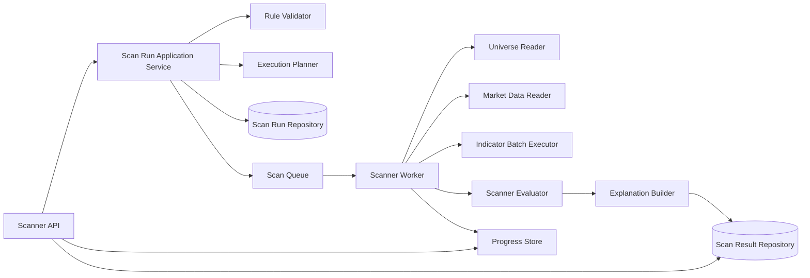
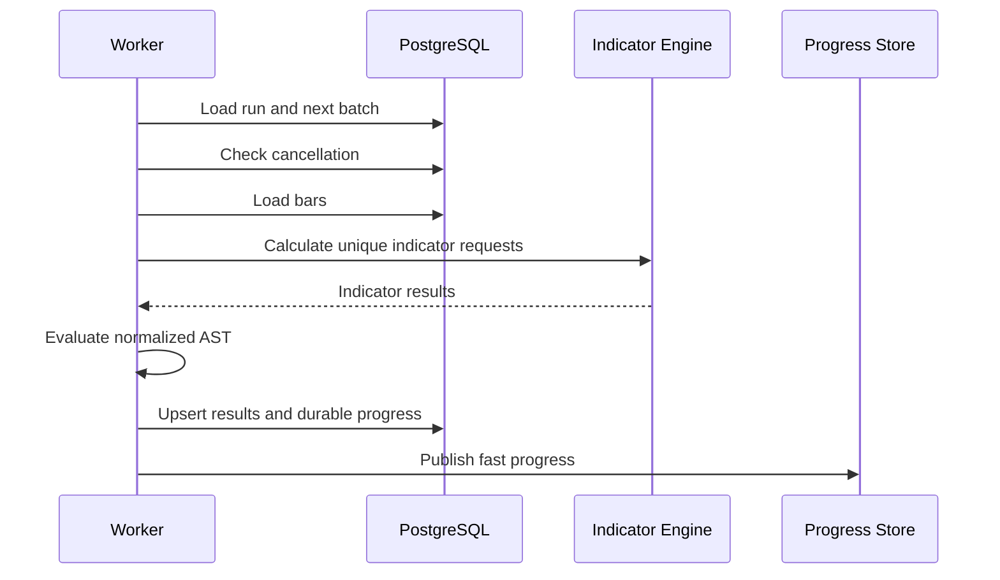

# ARCH-005 — Scanner Runtime Architecture

**Durum:** Uygulamaya hazır

## Bileşenler

## Run creation transaction

Transaction içinde idempotency, run insert, normalized rule, execution plan, universe snapshot reference ve initial state saklanır. Queue tek doğruluk kaynağı değildir; PostgreSQL run state kaynağıdır.

Queue publish başarısızlığı reconciliation ile tekrar denenebilir. Transactional outbox sonraki ölçülmüş ihtiyaçta değerlendirilebilir.

## Worker batch akışı

## Idempotency

Batch identity: `runId + batchIndex + planVersion`. Result unique constraint: `scanRunId + instrumentId`. Retry duplicate result üretmez.

## Cancellation

API DB'de `cancelRequested` işaretler. Worker batch sınırlarında kontrol eder. Terminal state'e geçiş domain state machine tarafından yönetilir.

## Failure isolation

Tek instrument hatası policy'ye göre `notEvaluable` + warning üretebilir. Sistemik veri, registry veya persistence hatası run'ı failed yapar.

## Progress

Redis hızlı progress içindir; terminal state ve güvenilir processed count PostgreSQL'de tutulur. Redis kaybı run sonucunu bozmaz.
