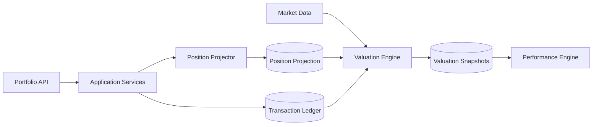

# ARCH-008 — Portfolio Ledger and Valuation Architecture

**Durum:** Uygulamaya hazır

Posted ledger tek doğruluk kaynağıdır. Position, cash, snapshot ve performance serileri yeniden üretilebilir projection/cache'dir.

`ledgerVersion` posted/reversed işlem değiştiğinde artar. Cache ve snapshot anahtarları bu version'ı içerir.

Transaction posting; ownership, validation, idempotency, quantity/cash policy, ledger insert, version increment ve projection dispatch adımlarını kullanır.

Rebuild tarih + deterministic sequence sırasıyla ledger'ı işler; corporate action uygular ve snapshot'ları invalidate eder.

Queue tek doğruluk kaynağı değildir. Projection ve valuation işleri için outbox veya reconciliation mekanizması gerekir.
