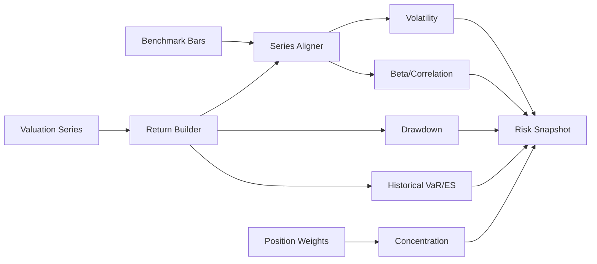

# ARCH-009 — Portfolio Risk Analytics Runtime

**Durum:** Uygulamaya hazır



Risk matematiği saf fonksiyonlarda tutulur.

Snapshot anahtarı:

```text
portfolioId + ledgerVersion + valuationSeriesVersion + analysisRange
+ benchmark + riskPolicyVersion + dataCutoff
```

Her metrik value, status, reason, observationCount ve methodologyVersion taşır. Bir metrik hesaplanamıyorsa tüm ekran düşmez.
