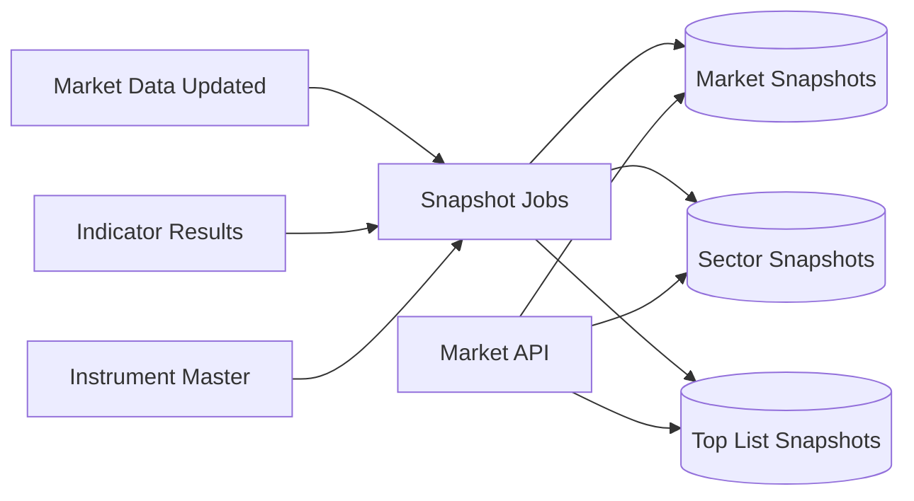

# ARCH-010 — Market Intelligence Read Models

**Durum:** Uygulamaya hazır

## İlkeler

- Ağır breadth ve ranking hesapları her HTTP request'te yapılmaz.
- Snapshot key market, cutoff ve policy version içerir.
- PostgreSQL güvenilir read model kaynağıdır; Redis kısa cache olabilir.
- Job retry duplicate snapshot üretmez.
- Partial input snapshot status ve excluded count taşır.
- Yeni closed bar ilgili timeframe snapshot'larını invalid eder veya yeniden üretir.

## Tutarlılık

Market overview birleşik response, mümkünse aynı snapshot generation id kullanır. Farklı generation'lar birleşirse response bunu açıkça belirtir.
