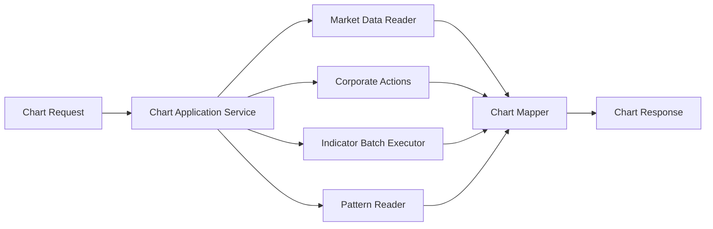

# ARCH-011 — Chart Data and Overlay Runtime

**Durum:** Uygulamaya hazır

## İlkeler

- Chart application service indicator hesaplarını deduplicate eder.
- Raw/adjusted seri policy aynı request içinde açıkça belirlenir.
- Bar, overlay ve marker timestamps normalize edilir.
- Kullanıcıya özel transaction/alert marker'ları ownership kontrolü sonrası eklenir.
- Cache anahtarı indicator versions ve params hash içerir.
- Maksimum bar/overlay/pattern limiti uygulanır.
