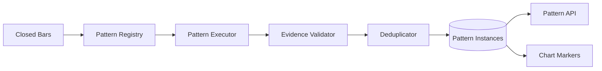

# ARCH-012 — Pattern Detection Runtime

**Durum:** Uygulamaya hazır

## İlkeler

- Pattern definitions saf ve versioned'dır.
- Worker yalnız closed-bar eventlerinde ilgili timeframe'i değerlendirir.
- Detection ve confirmation ayrı state transition'lardır.
- Future data candidate creation'da kullanılamaz.
- Evidence points ve parametreler persistence içinde versionlanır.
- Algorithm error tek symbol/timeframe'i notEvaluable yapabilir; sistemik hata retry edilir.
