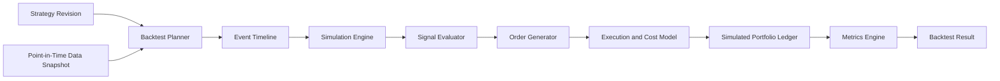

# ARCH-013 — Deterministic Backtest Engine

**Durum:** Uygulamaya hazır



## Saf çekirdek

Simulation engine DB, HTTP, Redis ve queue bağımlılığı taşımaz.

## Event timeline

- bar
- corporate action
- universe membership
- fundamental publication
- scheduled rebalance
- end-of-test

Aynı timestamp sırası versioned policy ile sabittir.

## State

- current time
- cash
- positions
- pending orders
- last prices
- strategy state
- trailing stops
- realized P&L
- fees
- warnings

## Akış

```text
signal
→ order intent
→ sizing
→ cash/risk validation
→ execution policy
→ fill
→ simulated ledger
```

## Determinism

- stable event/symbol ordering
- explicit rounding
- versioned policies
- no system clock dependency
- random varsa explicit seed
- unordered iteration bağımlılığı yok

## Checkpoint

Checkpoint event index, state hash, partial outputs ve engine version taşır. Retry duplicate fill üretmez.
