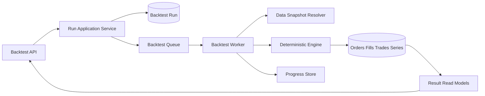

# ARCH-014 — Backtest Worker and Results Runtime

**Durum:** Uygulamaya hazır

## Run states

- queued
- resolvingData
- running
- calculatingMetrics
- completed
- failed
- cancelRequested
- cancelled
- expired

## Reliable dispatch

PostgreSQL kaynak; queue publish outbox/reconciliation ile güvenilir hale getirilir.

## Persistence

- summary
- equity/drawdown/cash/exposure series
- orders
- fills
- trades
- warnings
- methodology

Büyük seriler chunk/compression kullanabilir.

## Progress

Redis hızlı progress, PostgreSQL terminal state kaynağıdır.

## Cancellation

Data resolution, event batch ve metrics aşamalarında cooperative kontrol edilir.

## Retry

- snapshot load
- checkpoint restore
- metrics
- idempotent persistence

retry-safe olmalıdır.

## Retention

Plan bazında run, fills, trades, series, experiment ve export retention uygulanır.
