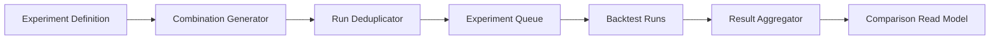

# ARCH-015 — Research Experiment Runtime

**Durum:** Uygulamaya hazır

## Combination generator

- deterministic order
- explicit values
- range-step validation
- max combination limit
- type validation

## Run reuse

Aynı revision, bindings, data snapshot ve policies için compatible completed run reuse edilebilir.

## Isolation

Alt run failure yalnız ilgili combination'ı failed yapabilir. Experiment partial status taşır.

## Aggregation

- one row per combination
- selected metrics
- warnings
- in/out-of-sample
- cost sensitivity
- rank fields

## Cancellation

Queued combinations durur, running run'lara cooperative cancel gider, completed sonuçlar korunur.

## Overfitting diagnostics

- combination count
- best/median gap
- out-of-sample degradation
- low trade count
- parameter neighborhood instability
- cost sensitivity
