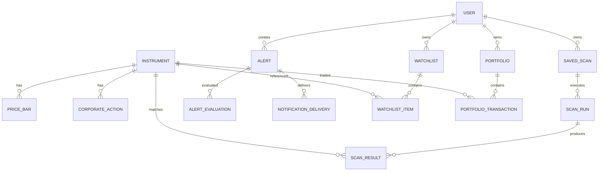

# DB-001 — Kavramsal Veri Modeli

Bu belge fiziksel SQL şeması değil, temel varlıklar ve ilişkiler için başlangıç modelidir.

## 1. Identity ve entitlement

- `User`: email, passwordHash, status, locale, timezone
- `Role`: code, name
- `UserRole`: userId, roleId
- `Session`: tokenHash, expiresAt, revokedAt
- `Plan`: code, name, active
- `Feature`: code, description
- `PlanFeature`: limitValue, configuration
- `Subscription`: status, startsAt, endsAt

## 2. Instrument Master

- `Instrument`: symbol, normalizedSymbol, name, market, currency, isin, sectorId, status
- `SymbolAlias`: symbol, validFrom, validTo
- `Sector`: code, name, parentId
- `MarketIndex`: code, name
- `IndexConstituent`: validFrom, validTo, weight
- `CorporateAction`: type, exDate, ratio, cashAmount, source

## 3. Market Data

- `DataProvider`: code, name, status
- `PriceBar`: instrumentId, timeframe, openTime, closeTime, OHLCV, isClosed, providerId, ingestedAt, revision
- `DataQualityIssue`: issueType, detectedAt, resolvedAt, details

Önerilen doğal benzersizlik: `instrumentId + timeframe + openTime + providerId + revision`.

## 4. Scanner

- `IndicatorDefinition`: code, version, parameterSchema, outputSchema, status
- `SavedScan`: ownerUserId, name, ruleVersion, ruleAst, visibility, status
- `PresetScan`: categoryId, name, description, ruleAst, active
- `ScanCategory`: code, name, parentId
- `ScanRun`: status, startedAt, completedAt, dataCutoffAt, universeSnapshot
- `ScanResult`: instrumentId, rank, score, explanation, computedValues

## 5. Alerts

- `Alert`: userId, sourceType, sourceId, channel, repeatPolicy, status
- `AlertEvaluation`: evaluatedAt, dataCutoffAt, matched, deduplicationKey
- `NotificationDelivery`: channel, status, attemptedAt, deliveredAt, errorCode

## 6. Kullanıcı özellikleri

- `Watchlist`: userId, name, sortOrder
- `WatchlistItem`: instrumentId, note, sortOrder
- `Portfolio`: userId, name, currency
- `PortfolioTransaction`: instrumentId, type, quantity, price, fees, transactionAt

## 7. Yönetim

- `AuditLog`: actorUserId, action, resourceType, resourceId, beforeData, afterData, occurredAt
- `FeatureFlag`: code, enabled, rules

## 8. ER görünümü

