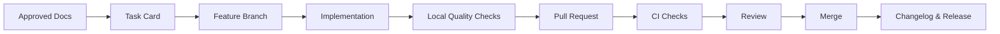

# DOC-007 — Development and Release Workflow

**Sürüm:** 1.0  
**Durum:** Onay için hazır

## 1. Amaç

Bu belge T3 Code ile görev yürütme, branch, pull request, CI ve sürümleme sürecini tanımlar.

## 2. İş akışı

## 3. Görev hazırlığı

Her görev kartı şunları içermelidir:

- amaç,
- kapsam,
- kapsam dışı,
- bağımlılık,
- teknik gereksinimler,
- güvenlik,
- performans,
- edge case,
- test,
- kabul kriteri,
- dokümantasyon etkisi,
- T3 Code prompt.

## 4. T3 Code görev başlangıcı

T3 Code:

1. üst seviye dokümanları okur,
2. görev kartını okur,
3. gereksinimleri özetler,
4. etkilenen dosyaları listeler,
5. çelişki kontrolü yapar,
6. uygulama planı sunar,
7. değişiklikleri uygular,
8. testleri çalıştırır,
9. dokümanı günceller.

## 5. Branch isimleri

- `docs/task-001-repository-validation`
- `chore/task-002-monorepo-scaffold`
- `chore/task-003-docker-dev`
- `feat/task-008-provider-abstraction`
- `fix/task-xxx-short-description`

## 6. Pull request şablonu

PR içinde:

- görev numarası,
- problem,
- çözüm,
- değişen modüller,
- migration,
- test sonucu,
- güvenlik etkisi,
- performans etkisi,
- ekran görüntüsü, uygunsa,
- geri alma planı

bulunur.

## 7. CI kapıları

Merge öncesi:

- formatting
- lint
- typecheck
- unit tests
- integration tests, ilgiliyse
- build
- migration check
- OpenAPI validation
- dependency boundary check
- secret scan
- dependency audit

başarılı olmalıdır.

## 8. Ortam akışı

- Local: geliştirici/T3 çalışma ortamı
- Test: otomatik test
- Staging: production benzeri doğrulama
- Production: kullanıcı ortamı

Production deploy yalnızca `main` üzerindeki onaylı sürümden yapılır.

## 9. Sürümleme

SemVer:

- patch: hata düzeltmesi
- minor: geriye uyumlu özellik
- major: kırıcı değişiklik

Doküman paketi sürümleri ayrı olarak:

- `0.1-foundation`
- `0.2-engineering-baseline`
- `0.3-market-data`
- `0.4-scanner-core`

şeklinde ilerleyebilir.

## 10. Database değişiklikleri

Her migration:

- ileri uygulanabilir,
- yeni kodla uyumlu,
- mümkünse geri alınabilir,
- büyük tablo etkisi değerlendirilmiş,
- staging'de test edilmiş

olmalıdır.

Destructive migration iki aşamalı yapılır.

## 11. Feature rollout

Riskli özellikler:

- feature flag,
- sınırlı kullanıcı,
- gözlemleme,
- kademeli açma,
- geri kapatma

ile yayınlanır.

## 12. Hata düzeltme

Kritik hata:

1. issue kaydı,
2. kapsam ve etki,
3. hotfix branch,
4. test,
5. review,
6. production deploy,
7. postmortem gerekiyorsa.

## 13. Görev kapanışı

Görev kartına:

- tamamlanma tarihi,
- commit/PR referansı,
- değişen dosyalar,
- testler,
- bilinen sınırlamalar,
- sonraki görev

notu eklenir.
